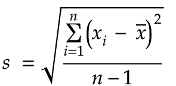
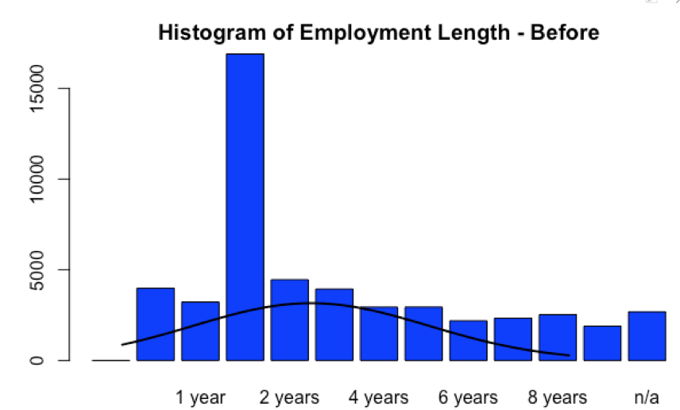
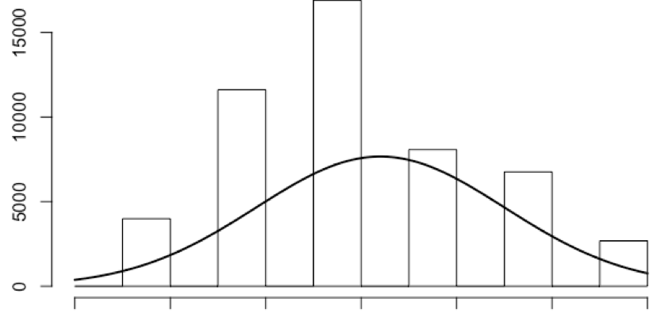

# The New Science of Winning
## An Introduction to Data Science

---

# Who?

- Benjamin J. Anderson
- Contractor - Eau Claire Development LLC
- Chief Privacy Engineer - Viacom/CBS
- Instructor at CVTC
- github.com/Vandise
- Aspiring Data Scientist

^ Dozens of research papers, all of which have been inconclusive / failures

^ I like emulation and transforming data into information

---

# What?

- What is Data Science and why should I care?
- Who are Data Scientists?
- Technologies
- Statistical Analysis with R
- Supervised Machine Learning
	- Data Exploration, Transformation, Sanitization
	- Variable Selection
	- Model Definition and Training

---

# Suggested Readings

- Big Data In Practice, Bernard Marr

- Weapons of Math Destruction, Cathy O’Neil

- OpenIntro Statistics, Diez, Barr, Rundel ( Free PDF )

- Hands-On Recommendation Systems with Python, Rounak Banik

---

# Ground Rules

- Never believe what a statistician tells you
- Never believe in charts or graphs
	- you can make them say anything
- Polls / random sampling are an irresponsible representation of a population

——-

——-

# So what is Data Science?

Textbook Definition:

- First defined in 1960 as “Datalogy”
- It’s a multi-disciplinary field like IT!
- It’s a “Buzzword”
- Traditionally called “Data Analyst”, “Mathematician”, “Statistician”, “DBA”
- Machine Learning is a small subset of the field

^ Datalogy - a combination of statistics and computer science

——-

# Why Should I Care?

- The worlds electronic data now exceeds 2.7 zettabytes (10^21)
- Anticipated to grow 60x that in the next decade
- Businesses are now collecting and storing junk/“big” data
- Cheap cloud computational resources allow the analyzation of “big” data
- Analyzation of “big” data often leads to competitive insights/gain
	- Can also be misleading i.e. Media “Pivot to Video”

^ Detect trends

^ Detect issues before they happen ( correlation / causation )

^ Prediction

——-

# Who are Data Scientists?

^ Forget everything the media and internet tells you

——-

# Who are Data Scientists Cont.

- Disciplined Mathematicians/Statisticians
- Often proficient in Data Warehousing and Querying Techniques
- Programming experience
	- Not often “Engineers”
- Data Delegates / Effective Communicators
- Intuitive

^ Intuitive problem solvers

^ Delegates: data presentation

——-

# Technologies

- R,  a funky array-based, statistical/functional programming language
- Python, Used because of its simplicity / ML support. Not always optimal in production
- SQL
- C, Java ( often in Production )
- Cloud Computing
	- ie Amazon Redshift, Google BigQuery

——-

# Maths
## A Statistics Refresher

——-

## Statistics - Normal Distributions & the Empirical Rule

——-

## Standard Deviation

- A quantity calculated to indicate the extent of deviation for a group as a whole

- The “spread” of data categorized into groups with the mean as the center point.

- Sigma ( σ ) for populations

- *s* for samples

——-

- n = the total sample size
- x-hat is the sample mean

——-

## The Empirical Rule

- In Data Science, we aim for accurate models
	- 95% is usually aimed for, but not always achievable

- The Empirical Rule states that 99.7% of all the fall within three standard deviations of the mean.

- 95% is within 2 standard deviations
	- Meaning if our data follows a normal distribution, the mean for a dataset on a specific day, week, month, etc. is generally a good baseline.

——-

## Statistics - Variables

A value with variable results.

- Categorical ( Qualitative )
	- Multiple values / categorizations, often a set of Strings

- Boolean ( Qualitative )
	- True/False

- Quantitative
	- A value that can be counted

——-

## Statistics - Variables

- Dependent
	- The outcome of an analysis, determined by one or many variables

There are several other types of variables, but these are the most frequent.

——-

# Lets Build a Model!

——-

# Problem Statement

A bank would like to be able to identify current loans that are at risk of defaulting.

- Conservative Approach - bank misses out on potential profit, but limits losses on loan defaults

- Aggressive Approach - bank doesn’t miss potential profits, but loses profits on loan defaults

——-

# So what do we do?

Depends on the clients requirements.

- Optimize for profit ( aggressive model )
- Optimize for accuracy ( conservative model )

We’re going to build two different Models for both!

——-

# Getting to know you(r) data

Follow along with:

- r/1\_know\_your\_data.r

Recap:

- 50,000 loan applications
- 32 variables

——-

# Getting to know you(r) data cont.

- Variables with NA’s?
- Identify “bad” loans / loans at risk of defaulting
- What variable type are we using when identifying loans as good/bad?
	- categorization or boolean would work in this case

——-

# Loan Information

Follow along with:

- r/2\_loan\_categorization.r

We have to change or create a categorization for the status variable:

- Charged Off = bad
- Default = bad
- Fully Paid = good

——-

## Variable Exclusion

Follow along with:

- r/3\_var\_exclusion.r

loanID:

- This unique identifier, though relevant to the bank, is not needed by our model to predict which loans may default.

totalPaid:

- This variable can only be determined after a loan has been issued and will be excluded from the test data. (Overfitting)

——-

## So exclude variables on intuition?

- Don’t ever exclude variables on intuition in the final model

- Initially only variables that over correct the model
	- totalPaid would do this

- There are statistical test(s) to select which variables to use in our model.
	- we’ll go over them when we build our model

——-

## Transforming Our Data

- We like normal distributions
- Some data follows it naturally, other times, not.
- We can generally produce normal distributions through categorical variables and data transformations
- Ie sqroot, log, cubed root, nlog

Why?

- convenience, reducing skewness, relationships

^ http://fmwww.bc.edu/repec/bocode/t/transint.html

——-

## Example: Categorical - Employment

- r/4\_transformation.r

^ Employment: uniform

——-

## Example: Categorical - Employment

Employment (categorized): normal slightly right-skewed

——-

## Removing / imputing values

- r/5\_removal.r

- Invalid records need to be removed or inferred
- Inference is more accurate if a normal distribution
	- mean, median, mode common inference

R reports missing values as “NA”. Use “summary” to see which variables have invalid records.

——-

## Variable Selection

You can anticipate which variables may be significant and formulate, then test the model, or run a variable correlation test as a baseline.

- We have to avoid highly correlated variables as they may cause us to overfit our model
	- meaning we may become good at prediciting good loans, but not bad
	- vise-verse 

——-

## Pearson Correlation Matrix Baseline

r/6\_var\_selection.r

- 0 = no correlation
- < 0 = negative correlation
- ~ +- 0.3 = some correlation
- ~ +- 0.8 = highly correlated

——-

## The logistic model

r/7\_initial\_model.r

We're going to use the correlation matrix as our primary driving factor for variable selection.

- dependent variable: loan_status
- Independent variables:
	- debtIncRat, pubRec, income, totalAcc, home, length, delinq2yr, rate, grade, inq6mth, reason, amount, totalRevBal, revolRatio

——-

## Model Assessment

- AIC: lower = better, but only relevant if comparing multiple models

- Coefficients ( variables )
	- Pr(>|z|) 
	- lower = more significant to the model
	- 0.05 is generally considered “significant”

- 77.78% accuracy is decent, we’re done right?

——-

## Sensitivity, Specificity, Accuracy

- Sensitivity
	- True-positive rate, correctly identify a positive categorical variable

- Specificity
	- True-negative rate, correctly identify a negative categorical variable

- Accuracy
	- The rate in which we are able to predict a value within a specified threshold

^ threshold is a range of values where predicted behavior is expected

——-

## Translation…

- Our model really struggles with identifying Bad loans, only predicting 7.33% of them.

- It does, however, accurately predict Good loans, capturing 98.0% of them

——-

## Pragmatically Finding an Optimal Threshold

r/8\_analysis.r

r/9\_analysis\_charts.r

Two Models:

- Profit

- Accuracy
